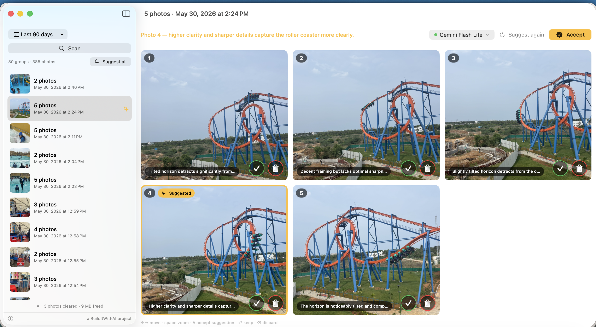

<div align="center">


# Whittle

**Keep the best shot. Let go of the rest.**

A native macOS app that finds bursts of near-identical photos in your library
and uses a local vision model to suggest which one to keep — you make every
decision, it just makes them faster.

[](https://github.com/surendranb/whittle/releases)
[](Sources)
[](LICENSE)
[](https://github.com/surendranb/whittle/releases/latest)
[](https://builditwithai.xyz)

[Download](#download) · [How it works](#how-it-works) · [Models](#models) · [Privacy](#privacy) · [Development](#development)



</div>

---

## The problem

You take 5–6 shots of the same moment. You need one. macOS duplicate detection
won't help — burst photos aren't duplicates, they're *near*-identical, differing
in a blink, a micro-blur, a half-smile. So they pile up, gigabyte by gigabyte.

Whittle finds those bursts, shows them side by side, and has a vision model
argue for one of them — *"sharpest of the set, everyone looking at camera"* —
so your only job is agreeing or overruling.

## How you use it

1. **Scan** a date range → burst groups appear in the sidebar (231 groups from
   1,100 photos in a couple of minutes, on a fan-less laptop).
2. **Suggest** — a local or cloud vision model picks the keeper in each group,
   with a one-line reason per photo. Or hit **Suggest all** and get a
   notification when every group is ready.
3. **Decide** — `A` accepts a suggestion (keep the pick, discard the rest,
   jump to the next group). Arrow keys move, Space zooms, ⏎ keeps, ⌫ discards.
4. **Delete** — one button, then *macOS itself* asks you to confirm. Deleted
   photos sit in Photos' Recently Deleted for 30 days.

The app never deletes, marks, or decides anything on its own. The running
tally ("312 photos cleared · 2.4 GB freed") is the reward.

## Download

**[⬇ Download Whittle 0.1.0 for macOS](https://github.com/surendranb/whittle/releases/latest/download/Whittle-0.1.0.zip)** — unzip, drag `Whittle.app` to Applications.

> **First launch:** this build isn't notarized, so macOS shows a one-time
> warning. Right-click `Whittle.app` → **Open** → **Open**. No other setup.
> Prefer building from source? ~30 seconds — see [Development](#development).

Requires macOS 14+ on Apple Silicon, and photos in the Apple Photos library.

## Up and running in 2 minutes

1. **Open Whittle** → grant Photos access → pick a range → **Scan**.
   Burst groups appear; you can review and clean up manually already.
2. **For AI suggestions, pick ONE of these:**

   **Have a local model?** If LM Studio or Ollama is running with a vision
   model, Whittle finds it automatically — it's already in the model picker.
   Nothing to configure.

   **Don't have local models?** Get a **free Google AI Studio key**
   (aistudio.google.com/apikey, no credit card) → click the model chip in
   Whittle → paste the key → pick **Gemini Flash Lite**. Done — suggestions
   in ~5 seconds per group on the free tier.
3. Click **Suggest all**, then review: `A` accepts a suggestion and advances.
   Delete when ready — macOS confirms, everything lands in Recently Deleted.

## Models

Suggestions work with any of these — scanning and manual review need none:

| Backend | Setup | Notes |
|---|---|---|
| **LM Studio** (recommended) | Download a vision model, enable the local server | Auto-discovered; vision models only. **Qwen3-VL-4B** won our quality/speed evals: ~14s per group, zero reasoning overhead, fully offline |
| **Ollama** | `ollama pull` any vision model | Auto-discovered via capability check *(untested against a live install — reports welcome)* |
| **Google AI Studio** | Paste a [free API key](https://aistudio.google.com/apikey) | Gemini Flash / Flash Lite / Gemma 4 with image input. Fastest option and the zero-install path; photos leave your Mac — the app says so before you use it |

Groups larger than 3 photos run as a **tournament** (rounds of 2–3, winners
advance) because small vision models judge small comparisons far more reliably
than big line-ups — and modest context windows agree.

Each photo also gets **native pre-scoring** injected into the prompt as
measured fact — sharpness, Apple's face-capture-quality score, eyes-open and
smile counts, face angle, horizon tilt, scene classification, and (on
macOS 15+) an aesthetics score. Grounding the judge in measurements is what
lets a 4B model do a 12B model's job. Details in [docs/research](docs/research/).

## Privacy

- Photos are read via PhotoKit and — with a local model — **never leave your Mac**.
- The cloud backend is opt-in, marked "photos leave this Mac" in the picker.
- Your API key lives in the **macOS Keychain**, read only at the moment a
  cloud request needs it. Never in files, logs, or UserDefaults.
- Anonymous telemetry to improve Whittle — opt out anytime (asked once on
  first run; footer toggle). No photos, no names, no IPs. Details and the
  open-source relay: [whittle.builditwithai.xyz/privacy](https://whittle.builditwithai.xyz/privacy).

## How it works

```
Photos library ──PhotoKit──▶ time clustering (≤10s gaps)
                              └─▶ visual clustering (Vision feature-prints,
                                  single-linkage, threshold 0.6)
                                   └─▶ burst groups (≥2 photos)
                                        └─▶ judge: native signals + photos
                                            ──▶ local/cloud VLM (tournament)
                                             └─▶ pick + reason per photo
                                                  └─▶ YOU decide → PhotoKit
                                                      delete (macOS confirms)
```

- **Clustering is deterministic and native** — no model involved, works offline, unit-tested.
- **The model only annotates.** It cannot mark, keep, or delete anything.
- **Structured output** is enforced (JSON schema via LM Studio / Gemini); a
  tolerant parser and a reason-scrubber handle models that narrate anyway.

## Development

No Xcode required — the Command Line Tools are enough:

```bash
./build.sh          # → .build/Whittle.app
open .build/Whittle.app
./test.sh           # clustering + tournament unit tests
```

Want to compare models on your own bursts? Export a burst to a folder and run
the standalone eval — it writes an HTML report with each model's pick so you
can judge the judges:

```bash
python3 eval/judge_eval.py --dir ~/Desktop/my-burst --answer 3
```

Research that shaped the design (model selection, benchmarks, packaging) lives
in [docs/research](docs/research/); the product principles in [PRODUCT.md](PRODUCT.md).

## Roadmap

- **Feedback loops** — learn from every accept/override ([design](docs/feedback-loops.md)): agreement stats per model, then prompt-level personalization, eventually a personal LoRA.
- **Embedded model** — llama.cpp in-process to drop the LM Studio dependency (researched, [notes](docs/research/2026-08-08-local-vlm-packaging.md)).
- **Signed & notarized builds** — removes the right-click-to-open dance and the per-build keychain prompt.
- Apple Foundation Models backend when macOS 27's image input ships.

## Contributing

Issues and PRs welcome — especially real-world burst reports where the model
picked wrong (that's eval gold). Keep PRs small and run `./test.sh`.

## License

[MIT](LICENSE) © 2026 Surendran Balachandran

---

<div align="center">

A **[BuildItWithAI](https://builditwithai.xyz)** studio project — *learning AI through building & sharing.*

</div>
